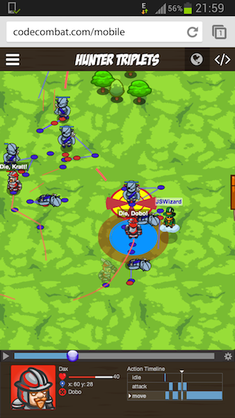
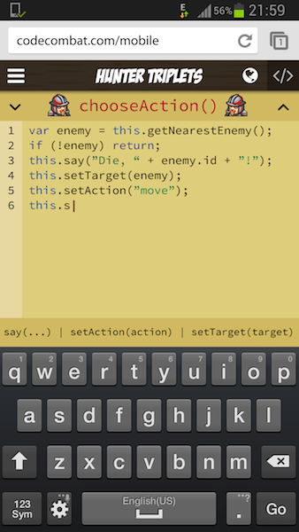
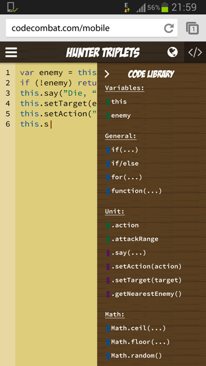
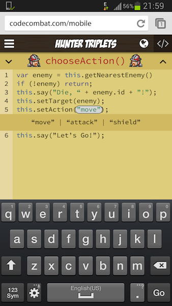
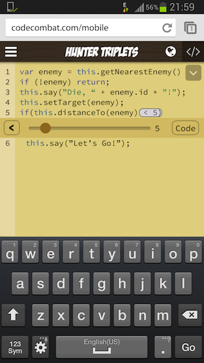

CodeCombat Proposal - Google Summer of Code 2014
------------------------------------------------

### What are your name, GitHub username, CodeCombat username, email address, and any blog/site links?
```
  GitHub: dkundel
  CodeCombat: jswizard
  Email: dominik.kundel@gmail.com
  Website: http://kundel.co
  Facebook: http://facebook.com/dominik402
  Twitter: http://twitter.com/dkundel
```

### What is your academic background?
I'm in my last Semester (6th) of a Bachelor of Science in Computer Science at Jacobs University Bremen, Germany

### What project do you want to build for CodeCombat?
I would love to work on building a mobile interface for CodeCombat that allows users to learn coding and have fun
even while being on the road.

### Why are you the right person to work on this project?
When I read the list of potential projects that project immediately caught my attention. I love the challenge of
finding a design that fulfills the necessary criteria:
- being easy to understand
- making the most out of the limit screen space
- being easy to use while still not neglecting the actual aim of learning how to code JavaScript

My previous contributions to CodeCombat mainly involved working on Tome so I got used the code, learned through the
feedback from the other contributors and the user community and got plenty ideas how to improve it. Additionally I
had to dig around in the Ace and Aether documentation and source code which saves me some time of actually understanding
them and I can focus more on designing and implementing the actual front-end.

### Why are you interested in CodeCombat?
I did not have any programming experience whatsoever when I started my studies. JavaScript was not taught in class
so I started learning it through educational pages such as Codecademy. Since then I was always interested in teaching
other people (mainly without CS background) how to code and that JavaScript is easy to learn.

### What have you already contributed to CodeCombat?
- I changed the line highlighting in Tome
- Added editor configuration support to Tome
- Implemented an easy way to get the coordinates
- Brought Treema to Bower
- Currently I’m working on the support of CoffeeScript in CoCo

### How do you plan to achieve completion of your project?
While contributing to CodeCombat I was thinking a lot about how a potential implementation could look like. I also
exchanged my ideas with Nick and came up with the following corner stones of the implementation:

#### 1. Split the play screen up into two views
In order to make the most out of the space of the screen I came up with the design to separate the view into two.
On the one view we can see the map and the basic info, we can select units and drag around the map. Additionally we
can access a variety of settings. If we swipe over at any point but the map or with a click in the top-right corner
we can switch back to the code editor. Additionally the code editor opens when ever we click on a unit just as users
are used to in the normal application.



#### 2. Smart Autocomplete
As writing on a phone or tablet requires way more effort than on a normal keyboard the part of code that needs to
be written should be minimal. To achieve that I thought of a smart autocomplete that on the one hand knows which
functions are available and on the other hand, when selected, inputs a snippet like code just like you have in Sublime
or Atom. The parts of the code that can be edited has prefilled default values that can be alternated using the
selectors described below. The offered functions are not limited to the width of the screen but more functions are
available when swipping to the side. The auto suggestions are not displayed above the text you are writing but
instead close to the keyboard to reduce the way between keyboard and autocomplete.

Using this approach a command such as `this.setAction` is the result of typing at most 6 characters. Afterwards you
can stick to the default value or click on the action to switch to another one. If you feel like swipping to the
side you can even reduce the number of characters. Alternatively you just use the code libary described in the next
section.



#### 3. Code Library

In case you want to avoid typing on the keyboard at all you can also open the code library through a button that appears
once you hide the keyboard. It displays all available spells, functions and variables that are available. Additional
color highlighting in front of the code categorizes the snippets to allow a faster picking of the desired code snippet.
The snippet will be on click inserted into the code at the current position in the same fashion as described earlier and
can then be modified using the selectors described below, by using again the code library or the autocomplete or by
sticking to the default values.



#### 4. Code changes through selectors
Again we try to minimize the amount of code that needs to be written. So after the smart autocomplete added a new
snippet we can alternate it by clicking on the respective parts. If we click on a function argument it knows
immediately potential arguments and gives you the choice to select from these. As another example we can click on
numbers and increase their value using a slider.



If we have a more complex snippet such as an if statement or a for loop the selector also gets more advanced. Just like
normal numbers we can change them using a slider. Additionally we have the chance to change the comparator or switch to
code input mode where we can use again the normal features of our smart autocomplete to input quickly and conveniently
code.




#### 5. Code oriented key board
Another approach would be to use a code oriented keyboard as other programs do. However as CodeCombat is currently designed
as a web application we do not have direct access in manipulating the keyboard and would have to build instead a screen keyboard.
While this is doable it would most probably not reach the performance of the standard keyboard and therefore an evaluation would
be necessary to see if the performance would still benefit from such a change even with having the smart autocomplete and the
other features.

#### 6. Others Remarks

To increase the area of code visible to you, you can also hide the unit selector row as shown in the last screenshot.

While I think ideally we would have in the end a completely responsive web applicaton for CodeCombat I think at the moment
the most feasible option would be to create a separate page for the mobile version. Therefore part of the project would
be also to move the necessary parts of the play view to the mobile version.

### Are you open to working in a team with other students on the project?

I think a mobile editor for CodeCombat could give the platform a huge push and I think it's therefore an important project
that I would be happy to share work on to make it the greatest mobile code editor available. I'm completely open for input from
other students.

### Please predict a schedule with dates and important milestones/deliverables (preferably in two week increments). Keep in mind Hofstadter's law.

#### May 26
Created a subsite that lets you load levels in `mobile` mode.

#### June 9
Separation of the two new views (if possible already including the responsiveness to adjust to various screensizes)

#### June 16
If the previous milestone caused issues with respect to adjusting to various screensizes it should be figured out by now.

#### June 30
Editor view in a state that let's you normally edit code and move between methods (no smart autocomplete or selectors)

#### July 14
Implement smart autocomplete for `this` statement and basic libaries such as `Math`.

#### July 28
Implement basic selectors for variables and method arguments.

#### August 11
Implementation of advanced selector statement

### August 18
Wrap up of project, last fixes and testing.


### Say you finish your project early or it proves impossible. What else would you be interested in working on?

While contributing to CodeCombat I fell in love with all parts of the projects including the sub-projects Aether and Treema.
I would be happy to contribute to anything but especially push Treema and Aether forward such that it's used for more projects
than just CodeCombat. So if I would have to pick from the provided list of projects I would probably choose the following:
- Improve Treema
- Create Developer Tools Window
- Make Aether Transpiler More Friendly

### What are your past experiences with contributing to open source?
- I did contribute to big open source projects earlier, however most of the projects I’m working on (private, job or hackathon) are hosted on GitHub.
- I recently started my own open source “movement” at our university to organize the different projects that are developed at our university and provide them a proper API to access the student directory at our university and build easy authentication.

### What other relevant projects have you worked on previously and what knowledge you gained from working on them?
- Almost all projects I work on are related to Web Development which make me gain extensive knowledge in JavaScript (and all dirty hacks :) )
as well as common frameworks.
- I'm currently working on an API for my university using MongoDB and are porting another web application that I created
for my university to MongoDB. Thanks to that I gained knowledge in MongoDB.
- Overall through various smaller/bigger projects for my jobs, hackathons or just free-time, I gained plenty of knowledge in various standard
frameworks. Frameworks/Technologies I use on a regular basis:
  - Node.JS (my favorite server, I think none of projects runs on Apache or so anymore)
  - MongoDB
  - AngularJS
  - Backbone


### What other time commitments, such as school work, another job, planned vacation, etc., will you have between May 19 and August 18?
- I will finish my Bachelor Thesis on May 11 and graduate from university on June  6. Therefore I won’t be busy with any jobs or school work. I’m planning a few short weekend trips however I will keep this in mind when scheduling my work and will work before and afterwards in a way that the missed days don’t interfere with the project.
